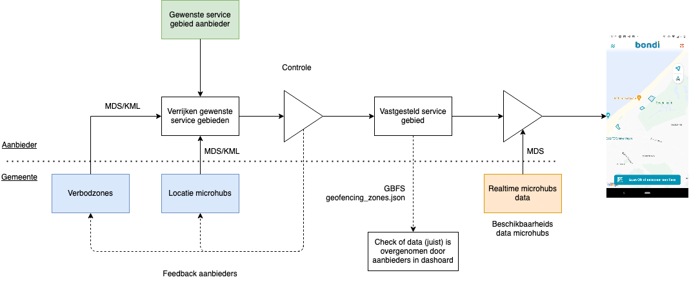
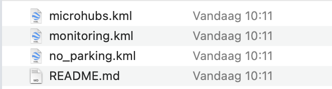
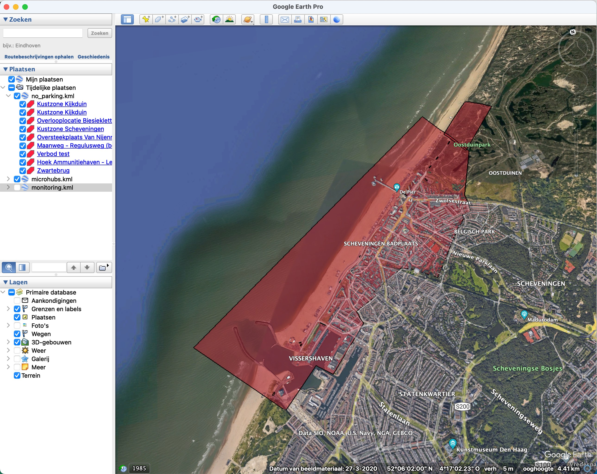

## Datauitwisseling microhubs deelmobiliteit

Microhubs met daaromheen een verbod om te parkeren zijn een goede manier om het parkeren van deelvoertuigen op locaties waar de druk op de openbare ruimte groot is beter te sturen en daarmee overlast van hinderlijk geparkeerde scooters te beperken. Vorig voorjaar hebben we in samenwerking met de gemeente Den Haag functionaliteit aan het Dashboard Deelmobiliteit toegevoegd die de locaties van deze microhubs en verbodszones ook beschikbaar maakt in de digitale wereld (https://www.verkeersnet.nl/actueel/44883/nieuwe-tool-helpt-overlast-deelvoertuigen-te-beperken/) en daarmee o.a. de gemeente in staat stelt om de beschikbare capaciteit te monitoren. 

## MDS

Vanaf het begin hebben we deze functionaliteit ontwikkeld met de gedachte in het achterhoofd dat deze data op een geautomatiseerde manier uit te wisselen moet zijn met aanbieders van deelmobiliteit. Voor het uitwisselen van deze informatie hebben we een internationaal breed geaccepteerde standaard toegepast, MDS (https://github.com/openmobilityfoundation/mobility-data-specification). Al deze data is vanaf het begin beschikbaar als open-data. Met als doel dat deze door aanbieders (semi-)automatisch verwerkt wordt in hun service gebied. Door hier een gestandaardiseerde databron voor te gebruiken worden fouten in het overnemen van service gebieden voorkomen en wordt het voor gemeenten makkelijker om sneller in te spelen op de situatie in de stad. Daarnaast zijn er ook nog andere toepassingen van deze data mogelijk zoals bijvoorbeeld het opnemen van deze informatie in reizigersinformatie (bijvoorbeeld: alle microhubs bij Scheveningen zijn vol, behalve bij het einde van het Zwartepad) of crowdcontrol dashboards behoort ook tot de mogelijkheden.

Voor bijvoorbeeld Den Haag ziet deze informatie in MDS er als volgt uit:

De locaties en het realtime aantal vrije parkeerplekken in microhubs:
https://mds.dashboarddeelmobiliteit.nl/stops?municipality=GM0518

De locaties van verbodszones:
https://mds.dashboarddeelmobiliteit.nl/policies?municipality=GM0518

De exacte locatie van een microhub/verbodszone:
https://mds.dashboarddeelmobiliteit.nl/geographies/43439894-f24d-11ec-9055-7e327dedfd67

Deze winter hebben we met de aanbieders van deelmobiliteit overlegd hoe zij deze informatie kunnen integreren in hun applicaties. Het proces waar we uit eindelijk naar toe willen laat zich goed illustreren door de volgende afbeelding. 

Gemeenten leggen verbodszones en microhubs vast het in het Dashboarddeelmobiliteit, aanbieders bepalen waar zij hun diensten willen aanbieden. Als je deze data bronnen combineert resulteert dat in een service gebied, de aanbieder doet een controlle op dit service gebied en staat in contact met de gemeente om eventuele wijzigingen voor te stellen. Daarnaast is het mogelijk om ook in realtime microhubs beschikbaar / niet beschikbaar te maken om bijvoorbeeld in het geval van drukte te voorkomen dat gebruikers van deelmobiliteit hun voertuig parkeren naast een microhub waardoor alsnog overlast kan ontstaan. 

### Een alternatief

Uit gesprekken met de aanbieders bleek dat geautomatiseerde uitwisseling via MDS op korte termijn een te grote uitdaging. Daarom hebben we een alternatief ontwikkeld om de eerste stapje (het uitwisselen van de locaties van de microhubs en verbodszones) van het toepassen van deze werkwijze laagdrempeliger te maken. Het alternatief is het exporteren van alle gebieden als KML files waarna aanbieders deze handmatig in hun systemen verwerken. Het KML formaat is een breed geïmplementeerd uitwisselingsformaat van geografische data die door alle GIS toepassingen wordt ondersteund. De data is onderverdeeld in drie bestandjes (microhubs, verbodszones en analyse zones) die los van elkaar in te lezen zijn. Veel vlootbeheersystemen van aanbieders zijn al in staat deze data handmatig in te lezen.

Ook de KML bestanden kun je zelf downloaden als open-data:
https://mds.dashboarddeelmobiliteit.nl/kml/export?municipality=GM0518

Naast het exporteren van KML's hebben we ook functionaliteit toegevoegd voor het importeren van KML bestanden. Dit maakt het mogelijk om microhubs die eerder in een ander GIS programma zijn ingetekend over te nemen in het dashboard deelmobiliteit. Op deze manier hopen we de drempel voor experimenteren van het uitwisselen van microhubs en verbodszones via het dashboard te verlagen en voor alle aanbieders een manier van uitwisselen van data te realiseren die in elke gemeente in Nederland op dezelfde manier werkt.

## Toekomstige ontwikkeling

Het toepassen van microhubs is een belangrijk onderdeel in het proces van volwassen worden van deelmobiliteit. De huidige functionaliteit in het dashboard is een eerste stap in het mogelijk maken van uitwisselen van deze informatie. Dinsdag 27 juni is de gebruikersbijeenkomst van het Dashboarddeelmobiliteit, dan bespreken we graag hoe we de uitwisseling verder vorm gaan geven en welke functionaliteit daarvoor nog moet worden toegevoegd aan het dashboard. 
