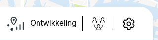

Gebruik je het Dashboard Deelmobiliteit en ben je organisatie-beheerder? Dan hebben we mooie nieuwe functionaliteiten voor je! Vanaf nu beheer je zelf de gebruikers in je organisatie, en kun je tevens data met mensen buiten je organisatie delen. In dit artikel leer je hoe dit werkt.

## Open het gebruikersbeheer

Het nieuwe gebruikersbeheer is alleen beschikbaar voor organisatie-beheerders. Normaal gesproken is 1 persoon binnen de organisatie een organisatie-beheerder. Deze heeft de verantwoordelijkheid over de ingestelde rechten, en kan deze uitgeven.

Ben je organisatie-beheerder? Dan open je het gebruikersbeheer met een klik op het nieuwe icoon:

## Beheer gebruikers

Onder het tabje **Gebruikers** zie je alle gebruikers die tot jouw organisatie behoren. Deze gebruikers hebben allen toegang tot dezelfde data waartoe je zelf ook toegang hebt.

Klik op **Nieuwe gebruiker** om een nieuwe gebruikers-account toe te voegen. Als opties kun je instellen:

- Is iemand organisatie-beheerder? Zo ja, dan kan diegene gebruikers beheren
- Is iemand onderdeel van het kernteam? Zo ja, dan ontvangt die uitnodigingen voor de kernteambijeenkomsten met overleg over het heden en de toekomst van het Dashboard Deelmobiliteit
- Kan de gebruiker microhubs beheren? Zo ja, dan verschijnt op de Zones-pagina een bewerkicoon, voor het beheren van de microhubs
- Kan de gebruiker ruwe data downloaden? Zo ja, dan verschijnt de ruwe download optie op de [Exporteer](/export)-pagina

## Deel data buiten de organisatie

Wil je data delen met externen? Klik dan op de tab **Data delen**.

Op de pagina zie je een overzicht van andere organisaties die toegang hebben gekregen tot de data van jouw organisatie. Als Gemeente Schiedam kun je bijvoorbeeld Gemeente Vlaardingen toegang verlenen tot de data van Gemeente Schiedam.

Op de pagina zie je ook een overzicht van individuele gebruikers die je expliciet toegang gegeven hebt tot de data van jouw organisatie.

### Verleen een andere organisatie toegang tot data van _jouw_ organisatie

Wil je een andere organisatie toegang geven tot jouw organisatie-data? Dit werkt als volgt:

1. Ga naar de tab **Data delen**
2. Klik op de knop: **Deel met organisatie**
3. Typ de naam van de organisatie en selecteer deze
4. Klik op de knop **Opslaan**

De geselecteerde organisatie heeft nu toegang tot alle data van jouw organisatie.

NB. Als de organisatie waarmee je wilt delen niet bestaat in de lijst, dan kun je contact opnemen met info@dashboarddeelmobiliteit.nl

### Verleen een andere gebruiker toegang tot data van jouw organisatie

Zo verleen je een specifieke gebruiker toegang tot de data van jouw organisatie:

1. Ga naar de tab **Data delen**
2. Klik op de knop: **Deel met gebruiker**
3. Typ het e-mailadres van de gebruiker die je toegang wilt verlenen
4. Klik op **Opslaan**

Als het e-mailadres al bekend was bij het Dashboard Deelmobiliteit, dan heeft de gebruiker nu toegang gekregen tot de data van jouw organisatie.

Als het e-mailadres nog niet bekend was bij het Dashboard Deelmobiliteit, dan heeft de gebruiker een welkomsmail ontvangen met daarin diens inloggegevens. Ook heeft deze gebruiker nu toegang tot de data van jouw organisatie.

### Verleende toegang intrekken

Je kunt te allen tijde verleende toegang intrekken. Dit doe je als volgt:

1. Ga naar de tab **Data delen** 
Je ziet een lijst met alle organisaties en personen met wie je data gedeeld hebt
2. Klik op het prullenbak-icoon waar je de toegang wilt intrekken
3. Klik op **Ja, stop met delen**

## Concluderend

Met deze nieuwe functionaliteiten kun je als organisatie-beheerder eenvoudig bepalen wie toegang heeft tot de data. 

Mocht je bij het gebruik hiervan feedback hebben, laat het ons weten! Wij zijn bereikbaar via info@dashboarddeelmobiliteit.nl

Team Dashboard Deelmobiliteit
