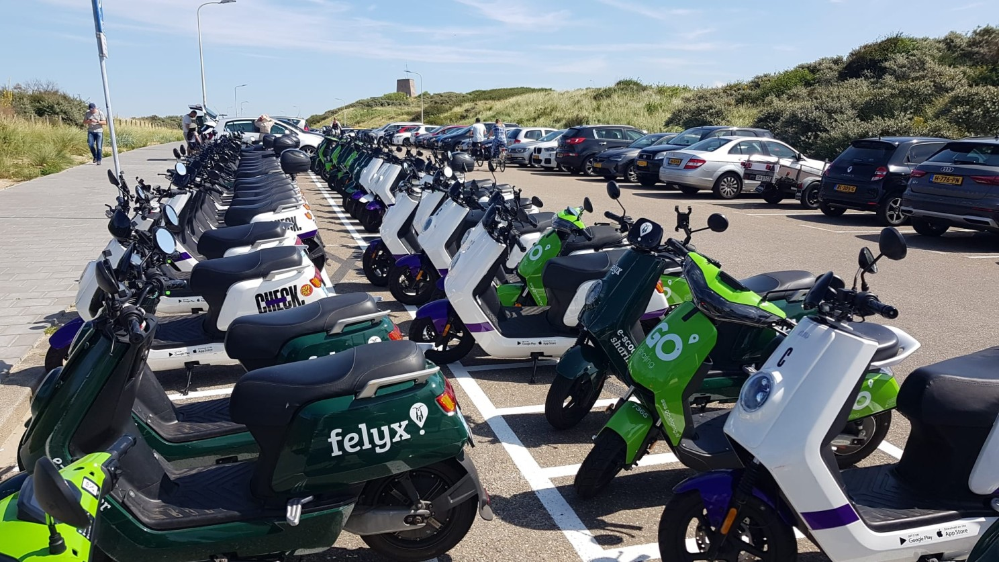

Vanmorgen was de lancering van het dashboard deelmobiliteit (met meer dan 100! online aanwezigen), een online tool om alle vormen van deelmobiliteit inzichtelijk te maken voor gemeenten. Het dashboard deelmobiliteit is de voortzetting van het deelfiets dashboard dat in 2019 ontwikkeld is om gemeenten meer inzicht en grip te geven in het gebruik van de free floating deelfietsen die op dat moment in opkomst waren. Het was op dat moment echt pionieren met enkele aanbieders die data beschikbaar stelden, vervolgens standaardiseerden we de data uitwisseling en werd het delen van data een eis om een vergunning te krijgen voor het aanbieden van deelmobiliteit. Inmiddels zitten er meer dan 13,500 voertuigen in het dashboard verspreid over heel Nederland en dat worden er elke dag meer.

## Van MVP naar volwaardige applicatie

De eerste versie van het dashboard was een echte MVP (minimal viable product), de snelheid van ontwikkelen is dan belangrijker dan alles perfect maken omdat je eerst wil checken of wat je bouwt nuttig en bruikbaar is. Dat bleek het geval en daarom hebben in twee stappen het MVP geüpgraded tot een volwaardige applicatie. Eind 2020 zijn we een nieuwe applicatie gaan gebruiken voor het verwerken van de gegevens van alle aanbieders die veel beter schaalbaar is en nauwkeurigere resultaten oplevert (de linkerkant van onderstaand plaatje). Met het vervangen van de frontend (de website zelf, rechterkant van het plaatje) zijn we afgelopen oktober gestart, vervangen was nodig om het dashboard beter in componenten op te splitsen dan tot nu het geval was. Dit maakt het in de toekomst veel eenvoudiger om nieuwe uitbreidingen te doen. Met het nieuwe dashboard hopen we enkele irritaties in de gebruikersinterface (die wij zelf ook hadden) te hebben opgelost en tegelijkertijd nieuwe visualisaties toe te voegen die het beter mogelijk maken om inzicht te krijgen in de data. Ook was het tijd voor een nieuwe naam, deelvoertuigen beperken zich niet alleen meer tot fietsen

## Opzet dashboard

Het dashboard bestaat uit drie onderdelen: aanbod, verhuringen en ontwikkelingen. Aanbod laat zien waar en hoelang elk voertuig te huur staat (of hoe lang het te huur stond in het verleden), dat kan gebruikt worden om inzicht te krijgen waar overlast ontstaat door langdurig geparkeerde deelvoertuigen en locaties te identificeren waar de dichtheid van deelvoertuigen hoog is. In onderstaand overzicht zie je bijvoorbeeld hoe deelvoertuigen over de stad verdeeld zijn op dit moment.

Verhuringen laat zien op welke plaatsen er verhuringen gestart of beëindigd werden gedurende een bepaald tijdsinterval, deze weergave is bedoeld om een gevoel te krijgen bij hoe deelmobiliteit gebruikt wordt in jouw stad. In het screenshot hieronder zie je de bestemmingen waar de deelvoertuigen naar toe gingen in de ochtendspits vanmorgen. Flinke concentratie richting het Erasmus MC, de universiteit en Rotterdam Centraal. In de avondspits zie je een omgekeerd patroon.

Ontwikkelingen laat zien hoeveel voertuigen van elke aanbieder actief zijn in een bepaald gebied en hoeveel verhuringen deze aanbieder per dag doet in een bepaald gebied, handig om de ontwikkeling van deelvervoer over langere tijd beter te begrijpen. In onderstaand screenshot zie je de ontwikkeling van het aantal beschikbare voertuigen in Rotterdam in de afgelopen 90 dagen.

## Open-source

Vanaf begin af aan is het deelfietsdashboard (en nu ook dashboarddeelmobiliteit) met de gedachte ontwikkeld dat alle software die ontwikkeld wordt open-source moet zijn en zoveel mogelijk gebruik moet maken van open-source componenten (PostgreSQL, PostGIS, Redis, React, MapLibre). Dit vanuit de filosofie dat iedereen moet kunnen voortbouwen op software die betaald wordt vanuit belastinggeld en tegelijkertijd transparantie te bieden over wat we precies doen.

Voor de techneuten die het leuk vinden, de dashboard software is hier te vinden https://github.com/Stichting-CROW/dashboarddeelmobiliteit-app en backend hier https://github.com/Stichting-CROW/dashboarddeelmobiliteit-api en hier https://github.com/Stichting-CROW/dd-importer-v2. Lijkt het je leuk om op ons dashboard verder te bouwen of functies aan het bestaande dashboard toe te voegen laat het ons dan weten, wij helpen je graag op weg!

## Toekomst

De groei van deelmobiliteit zorgt voor nieuwe uitdagingen. Om meer sturing te geven in de plaatsen waar deelvoertuigen worden geparkeerd in de openbare ruimte kunnen microhubs een oplossing bieden. De gemeente Den Haag experimenteert hier al een tijdje mee, zoals hier op Scheveningen waar autoparkeerplaatsen worden opgeheven om plaats te maken voor deelvervoer. Het dashboard kan in de toekomst mogelijk ook helpen om vakken te definiëren, een maximale capaciteit in te stellen en vakken af te sluiten wanneer ze vol zijn en dat automatisch te communiceren met deelvervoeraanbieders. Afgelopen zomer hebben we al geëxperimenteerd met een dashboard specifiek voor het monitoren van deze vakken https://deelfietsdashboard.nl/public/den-haag/

Een veel gehoord verzoek voor nieuwe functionaliteit is een HB-matrix (voor de jongere mensen hier waarschijnlijk beter bekend als OD-matrix), dat is een visualisatie die we willen gaan onderzoeken en in de toekomst wellicht kunnen toevoegen.

De laatste tijd kregen we ook veel vragen van aanbieders over wat het verschil was tussen CDS-M en het dashboard. Daar is de afgelopen weken gelukkig veel verheldering in gekomen door een goede samenwerking met het CDS-M team. CDS-M heeft als doel om een framework met afspraken te ontwikkelen over hoe aanbieders en gemeenten met elkaar samen werken, gebruik makend van bestaande technische standaarden. Het dashboard deelmobiliteit kun je daarmee zien als praktische invulling van CDS-M. De komende tijd gaan we dit met de gemeente Amsterdam verder vormgeven en wordt dit dashboard gebruikt om de data uitwisseling te valideren.

## Tot slot

Het nieuwe dashboard had niet ontwikkeld kunnen worden zonder het vertrouwen van de gemeenten en CROW, dank daarvoor! Ik ben ervan overtuigd dat we iets moois hebben neergezet waar we de komende jaren op voort kunnen bouwen.

Dit dashboard is ontwikkeld met een collectief van ZZP'ers, de eerste keer dat ik op zo'n manier heb samengewerkt, ongelofelijk hoe snel je iets kunt ontwikkelen wanneer je de krachten bundelt. Credits voor Janine Terlouw voor het omzetten van onze ideeën in een prachtig designs en voor Bart Roorda en Marc Buma voor het samen ontwikkelen van de code voor de frontend.

Ga het dashboard vooral zelf uitproberen! Er is een openbaar gedeelte dat voor iedereen toegankelijk is https://dashboarddeelmobiliteit.nl/. Als je werkt voor een gemeente of deelmobiliteitsaanbieder kun je ook inloggen, heb je nog geen account stuur dan een mail naar info@dashboarddeelmobiliteit.nl. Ook horen we via dit emailadres graag eerste reacties en suggesties voor verbeteringen!
